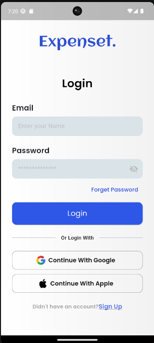
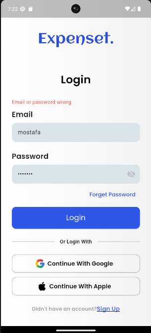
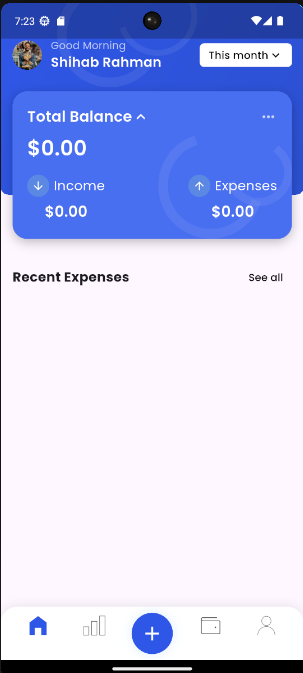
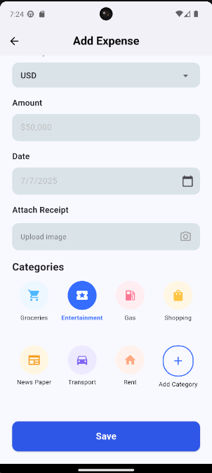
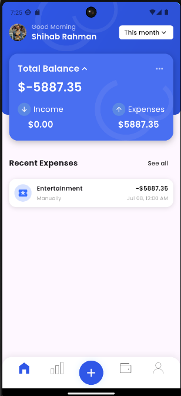

💸 Expense Tracker App
A modern and clean Flutter expense tracker, built with Clean Architecture and BLoC pattern.

✨ Features
Add and categorize expenses (with custom colors and icons)

Multi-currency support (USD, EGP, EUR, SAR, GBP) with live currency conversion

Attach receipt images to expenses

Beautiful dashboard with animated header & custom navigation bar

Pagination for infinite expenses

Full Clean Architecture (Data, Domain, Presentation)

Local storage with Hive

Bloc/Cubit state management

Unit test samples

🏗️ Structure
lib/
│
├── features/
│   ├── auth/
│       ├── data/
│           ├── data_sources/
│           ├── models/
│           └── repo_implementation/
│       ├── domain/
│           ├── entities/
│           ├── repo_interface/
│           └── use_cases/
│       └── presentation/
│           ├── widgets/
│           ├── screens/
│           └── cubit/
│   └── expenses/
│       ├── data/
│           ├── data_sources/
│           ├── models/
│           └── repo_implementation/
│       ├── domain/
│           ├── entities/
│           ├── repo_interface/
│           └── use_cases/
│       └── presentation/
│           ├── widgets/
│           ├── screens/
│           └── cubit/
│
├── core/          # Shared utils, themes, etc.
└── main.dart
🚀 Getting Started
Clone the repo:

sh
git clone https://github.com/mostafaahmd/expense-tracker.git
cd expense-tracker
Install dependencies:

sh
flutter pub get
Generate code (if needed):

sh
flutter pub run build_runner build --delete-conflicting-outputs
Run the app:

sh
flutter run
⚙️ Tech Stack
Flutter 3.x

Hive (local NoSQL)

BLoC/Cubit for state management

Clean Architecture (Domain/Data/Presentation)

exchangerate-api.com for currency conversion

🧪 Testing
Run all unit tests:

sh
flutter test
📸 Screenshots

🙋‍♂️ Author
Mostafa Mansour
GitHub

